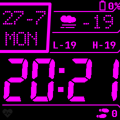

# InfiniTime — Personal

Personal [InfiniTime](https://github.com/InfiniTimeOrg/InfiniTime) fork for the PineTime. Built on upstream `main`; this page only covers what differs.

## Changes vs upstream

### Heart rate
- Background interval options: Off, Continuous, 30s, 1m, **3m**, 5m, 10m (removed 30m)
- **Start** state persists across reboot (so background HR keeps working after power cycle)
- Pauses while charging; resumes when unplugged
- Watch faces no longer show a bogus `0` BPM while measuring / waiting for a valid sample
- While PPG is re-acquiring, keep the last known BPM on screen (only clear when nothing was shown yet)
- **PPGv2** heart-rate algorithm ([upstream #2371](https://github.com/InfiniTimeOrg/InfiniTime/pull/2371)): motion-adaptive filtering, auto gain/drive, reports failure instead of wrong BPM
- PPGv2: still run AGC / background timeout when `hrs == 0` so off-wrist no-touch cannot spin the green LED forever

### Casio Custom watchface
- Renamed from **Casio Style G7710** to **Casio Custom**
- Weather-focused layout: date and day on the left; icon, temperature, and daily low/high on the right (replaces week number / day-of-year)
- Empty weather shows `--` / `L--` `H--` until Gadgetbridge syncs
- **Warm Cockpit** theme (fixed role colors): amber time, orange date/day, soft-cyan weather, red HR, lime steps, dim-amber lines/status chrome
- Battery % and icon keep the independent Terminal HSV charge curve (green→yellow→red; not themed)
- Long-press overlay: brightness only (paintbrush single-color cycle removed for this themed face)
- Top status bar shows a bell when the alarm is enabled
- Status icons realign only when battery / BLE / alarm / notification state changes
- Flash font load falls back to built-in JetBrains if `lv_font_load` fails
- No AM/PM letter on the face (12h still shows 1–12 digits only)
- **Two flash fonts** (PPGv2 RAM headroom): `7segments_115` for the big time + `lv_font_dots_40` for date/day/temp; dropped `7segments_40`. L/H still use built-in JetBrains Bold 20

InfiniSim README screenshots of this face must inject weather (`w` in the sim, or `--casio-preview` which does it automatically); without weather the right side shows `--` placeholders.

### Watch faces
Built into firmware: **Digital**, **Terminal**, **Casio Custom** (default for factory / wiped settings).
Removed from the default build: Analog, PineTimeStyle, Infineat, Pride Flag (also drops `open_sans_light` from firmware fonts).

### Apps
Removed from the default app list **and no longer compiled**:
- Paint
- Paddle
- Twos
- Dice
- Metronome

Kept: Stopwatch, Alarm, Timer, Steps, Heart Rate, Music, Navigation, Calculator, Weather

App polish:
- Heart Rate: DirtyValue-gated BPM/status; status text includes **Ready** (not “Measuring…”)
- StopWatch: DirtyValue-gated hundredths (less LVGL churn while running)
- Timer: long-press release no longer flashes **Start** while ringing
- Alarm: dismisses open info overlay when alerting; tighter “time to alarm” copy
- Counter widget: skip redraw when value unchanged (helps Timer)

### Defaults
- Watch face: **Casio Custom** (factory / wiped settings only; existing `settings.dat` is unchanged)
- Wake-up: **Double Tap** enabled by default (factory / wiped settings only; existing `settings.dat` is unchanged)

### Bug fixes
- Timer: screen can sleep again after tapping **Reset** during the ring ([upstream #2419](https://github.com/InfiniTimeOrg/InfiniTime/issues/2419))
- Timer: keep buzzing for the full 10s after expiry if ringing was interrupted ([upstream #2428](https://github.com/InfiniTimeOrg/InfiniTime/pull/2428))
- Alarm: dismissing a ringing alarm returns to the previous screen instead of the editable alarm config ([upstream #2405](https://github.com/InfiniTimeOrg/InfiniTime/issues/2405))
- Notifications no longer interrupt a ringing alarm/timer or the flashlight ([upstream #1223](https://github.com/InfiniTimeOrg/InfiniTime/issues/1223) / [#610](https://github.com/InfiniTimeOrg/InfiniTime/issues/610))
- Motor: `StopRinging()` also cancels any pending short vibration pulse
- HR: charging pause clears stale BPM; HR task queue send is ISR-safe when called from task context
- BLE FS: `WriteResponse.status` always initialized (success and failure); oversize path early-outs release the file-transfer wake lock ([upstream #2457](https://github.com/InfiniTimeOrg/InfiniTime/issues/2457))
- BLE CTS: initialize `dayofweek` and `reason` on current-time reads ([upstream #2459](https://github.com/InfiniTimeOrg/InfiniTime/pull/2459))
- SPI: chunk EasyDMA reads to ≤255 bytes (same limit as writes) ([upstream #2391](https://github.com/InfiniTimeOrg/InfiniTime/pull/2391))
- FS: serialize littlefs with a recursive mutex across tasks ([upstream #2449](https://github.com/InfiniTimeOrg/InfiniTime/pull/2449))
- Persist time + steps across soft reboots via noinit RAM ([upstream #2400](https://github.com/InfiniTimeOrg/InfiniTime/pull/2400) / [#2293](https://github.com/InfiniTimeOrg/InfiniTime/issues/2293))
- DisplayApp: no-op `LVGL_GUARD` hooks for InfiniSim thread-safety ([upstream #2447](https://github.com/InfiniTimeOrg/InfiniTime/pull/2447))
- Weather: equality compares `minTemperature` to `minTemperature` (was wrongly vs `max`)
- DateTime: compile-time fallback year set after logger init ([upstream #2396](https://github.com/InfiniTimeOrg/InfiniTime/issues/2396))
- DateTime: `to_time_t` cast compatible with libc++ ([upstream #2456](https://github.com/InfiniTimeOrg/InfiniTime/pull/2456))
- GPIOTE: button + touch use high-accuracy sensing so edges are not dropped while both IRQs are live ([upstream #2346](https://github.com/InfiniTimeOrg/InfiniTime/issues/2346))
- DisplayApp: `TouchEvent` queue send is non-blocking (same deadlock avoidance as notifications) ([upstream #2290](https://github.com/InfiniTimeOrg/InfiniTime/issues/2290) / [#2124](https://github.com/InfiniTimeOrg/InfiniTime/issues/2124))
- Stopwatch: rebuild lap list in one buffer instead of repeated `lv_label_ins_text` (reduces LVGL churn under mash)
- Docker: ensure `build.sh` is executable in the image ([upstream #2367](https://github.com/InfiniTimeOrg/InfiniTime/pull/2367))
- Battery icon: low-battery color no longer overwrites the configured base color ([upstream #2208](https://github.com/InfiniTimeOrg/InfiniTime/pull/2208))
- Battery icon / Digital status: continuous green→yellow→red tint from charge % (Terminal curve; same idea as upstream [#1964](https://github.com/InfiniTimeOrg/InfiniTime/pull/1964))
- Music: show waiting placeholders until real track metadata arrives ([upstream #1841](https://github.com/InfiniTimeOrg/InfiniTime/pull/1841))
- SPI: chunk `WriteCmdAndBuffer` payloads the same way as reads/writes
- Stopwatch: lap labels wrap in 1..999 (0 is empty-slot sentinel, so `% 1000` made laps vanish)
- Notifications: `GetPrevious` bounds against valid count, not buffer capacity
- Notifications: drop exact duplicates already in the ring buffer (common companion double-send)
- Notifications: FS/DFU deny alerts also gate `OnNewNotification` on `PushIfNew` (no re-vibe on spam)
- Notifications: don't rebuild the preview screen when already previewing (avoids re-vibe + timeout reset)
- Music GATT: register track-number UUID once (was a duplicate total-length characteristic)
- DateTime: skip `OnNewTime` when CTS pushes an unchanged wall clock (avoids redundant alarm reschedule)
- Motor: coalesce `StartRinging()` if already ringing
- Chime: don't reload Clock when already there; don't interrupt ringing timer/alarm/call/flashlight
- Pairing: update passkey in place instead of rebuilding PassKey
- Charging: ignore duplicate power-present edges; HR pause/resume only transitions once
- Alarm: coalesce `SetOffAlarmNow` / don't leak a second auto-stop LVGL task while alerting
- CI: set `REF_NAME` in the InfiniSim job so artifacts are not named `infinitisim-` ([upstream #2223](https://github.com/InfiniTimeOrg/InfiniTime/issues/2223))
- HR: wake sensor after unplug even if the screen was already on; never publish ambient `-1`/`-2` as BPM 254/255
- Charging: latch handled power-present so `MeasureVoltage` can't make a real plug edge look like a no-op
- BLE FS: hold `FS::Lock` across open/seek/read|write/close; don't `FileClose` after a failed READ_PACING open
- Alarm settings: only `DirClose` when `DirOpen` succeeded
- Music: initialize play/position members; return metadata by const ref (no per-refresh string copies)
- DFU: keep version `0x0008` separate from GATT handles; stop re-resolving chars on every access
- SystemTask: grow main stack 350→400 words (margin for upstream [#2407](https://github.com/InfiniTimeOrg/InfiniTime/issues/2407) worst-case)
- Pairing: vibrate only when first showing PassKey
- Notifications / HR controller: defensive empty-message and null-service guards

### InfiniSim
Companion simulator: [InfiniSim---Personal](https://github.com/lecrackzor/InfiniSim---Personal) (trimmed faces/apps, PPGv2 HR, Warm Cockpit Casio keys).

Sim patches and helpers live in that repo (`tools/run-infinisim.sh`, etc.). Build the sim locally — its GitHub Actions CI is disabled.

## Upstream

Based on [InfiniTimeOrg/InfiniTime](https://github.com/InfiniTimeOrg/InfiniTime). Same GPL-3.0-or-later license. Build, flash, and BLE docs live in upstream’s `doc/` tree.
