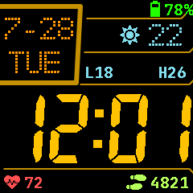

# InfiniTime — Personal

Personal [InfiniTime](https://github.com/InfiniTimeOrg/InfiniTime) fork for the **PineTime**. Built on upstream `main`; this page covers what differs and how to use it.

**Companion:** stock [Gadgetbridge](https://codeberg.org/Freeyourgadget/Gadgetbridge) (no custom companion fork required).

**Simulator:** [InfiniSim — Personal](https://github.com/lecrackzor/InfiniSim---Personal)

---

## Highlights

| Area | Personal changes |
| --- | --- |
| Watch face | **Casio Custom** (Warm Cockpit) — weather-first layout, default face |
| Heart rate | PPGv2, background intervals including **3m**, charging pause, saner GB reporting |
| Apps / faces | Trimmed firmware (no Paint/Paddle/Twos/Dice/Metronome; Analog/PTS/Infineat/Pride Flag off by default) |
| BLE | Hardened DFU/FS/HR/notifications for stock Gadgetbridge |
| Defaults | Double-tap wake on; Casio Custom face (factory / wiped settings only) |

---

## Flash

1. Enable **Firmware & files** on the watch.
2. Install the DFU zip from Gadgetbridge (or copy `build-output/pinetime-mcuboot-app-dfu-1.16.0.zip.fw`).
3. Latest personal build artifact (local): `build-output/pinetime-mcuboot-app-dfu-1.16.0.zip`

Upstream docs for build/flash/BLE live under [`doc/`](doc/).

---

## Casio Custom

Renamed from Casio Style G7710.

- Weather-focused layout: date/day left; icon, temperature, daily low/high right
- Empty weather shows `--` / `L--` `H--` until Gadgetbridge syncs
- **Warm Cockpit** colors: amber time, orange date/day, soft-cyan weather, red HR, lime steps
- Battery % keeps the Terminal HSV charge curve (green→yellow→red)
- Long-press overlay: brightness only
- Status bar: alarm bell when enabled; icons realign only on state change
- Two flash fonts (`7segments_115` + `lv_font_dots_40`); JetBrains Bold 20 for L/H
- No AM/PM letter (12h still shows 1–12)

InfiniSim: populate weather/HR/steps with `--casio-preview`, or keys `w` / `h` / `s`.

---

## Heart rate

- Background intervals: Off, Continuous, **30s**, **1m**, **3m**, **5m**, **10m** (30m removed)
- **Start** state persists across reboot
- Pauses while charging; resumes when unplugged
- Faces show no bogus `0` BPM; hold last BPM while Searching (clear only if none yet)
- **PPGv2** ([upstream #2371](https://github.com/InfiniTimeOrg/InfiniTime/pull/2371)): motion-adaptive filtering, AGC, reports failure instead of wrong BPM
- AGC / background timeout still run when `hrs == 0` (off-wrist LED cannot spin forever)

### Gadgetbridge reporting

| Mode | BLE behavior |
| --- | --- |
| Timed background (30s / 3m / …) | One always-notify per measurement session |
| Continuous / foreground | Change-only notifies |
| Searching with held face BPM | No BLE `0` spam |
| Subscribe seed | Only if BPM > 0 |

---

## Watch faces & apps

**Built-in faces:** Digital, Terminal, **Casio Custom** (default for factory / wiped settings).

**Removed from default build:** Analog, PineTimeStyle, Infineat, Pride Flag (`open_sans_light` dropped).

**Removed apps (not compiled):** Paint, Paddle, Twos, Dice, Metronome.

**Kept:** Stopwatch, Alarm, Timer, Steps, Heart Rate, Music, Navigation, Calculator, Weather.

App polish includes DirtyValue-gated HR/StopWatch redraws, Timer/Alarm UX fixes, and Counter skip-redraw when unchanged.

---

## Defaults (factory / wiped `settings.dat` only)

- Watch face: **Casio Custom**
- Wake-up: **Double Tap** enabled

Existing settings files are left as-is on upgrade.

---

## Reliability & BLE hardenings

Personal work beyond upstream cherry-picks focuses on watch stability with stock Gadgetbridge:

- **HR BLE:** stop ~20 Hz floods from Cont/background; change-only where needed
- **DFU:** prep wake lock, size caps, mbuf length checks, no write past image size
- **FS BLE:** contiguous mbuf checks, path/payload length validation, TRUNC writes, LISTDIR abort safety
- **Settings / alarm / bonds:** full-read validation, TRUNC saves, bond persist/restore checks
- **Sensors:** recover stuck battery ADC; report SPI/I2C failures; single BMA421 poll owner
- **UI:** notification container safety; HR faces clear on Ready→Searching; sleep brightness ramp aborts on wake

Also includes a large set of upstream bugfixes (timer/alarm/notifications sleep, SPI EasyDMA chunking, littlefs mutex, soft-reboot persistence, GPIOTE accuracy, etc.). See git history for the full list.

---

## InfiniSim

Companion simulator: [InfiniSim---Personal](https://github.com/lecrackzor/InfiniSim---Personal) (trimmed faces/apps, PPGv2, Warm Cockpit Casio keys).

Build locally — GitHub Actions CI for the sim is disabled. Helpers live in that repo (`tools/run-infinisim.sh`, etc.).

---

## Upstream

Based on [InfiniTimeOrg/InfiniTime](https://github.com/InfiniTimeOrg/InfiniTime).

- License: **GPL-3.0-or-later** (same as upstream)
- Build, flash, and BLE protocol docs: upstream [`doc/`](https://github.com/InfiniTimeOrg/InfiniTime/tree/main/doc)
