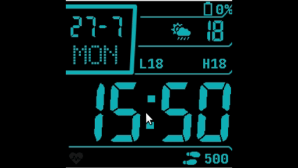

# InfiniTime — Personal

Personal [InfiniTime](https://github.com/InfiniTimeOrg/InfiniTime) fork for the PineTime. Built on upstream `main`; this page only covers what differs.

## Changes vs upstream

### Casio Custom watchface
- Renamed from **Casio Style G7710** to **Casio Custom**
- Weather-focused layout: date and day on the left; icon, temperature, and daily low/high on the right (replaces week number / day-of-year)
- Long-press overlay: cycle face color (paintbrush) and step display brightness

### Apps
Removed from the default app list:
- Paint
- Paddle
- Twos
- Dice
- Metronome

Kept: Stopwatch, Alarm, Timer, Steps, Heart Rate, Music, Navigation, Calculator, Weather

### Heart rate
- Background interval options: Off, Continuous, 30s, 1m, **3m**, 5m, 10m (removed 30m)
- **Start** state persists across reboot (so background HR keeps working after power cycle)
- Pauses while charging; resumes when unplugged
- Watch faces no longer show a bogus `0` BPM while measuring / waiting for a valid sample

### Bug fixes
- Timer: screen can sleep again after tapping **Reset** during the ring ([upstream #2419](https://github.com/InfiniTimeOrg/InfiniTime/issues/2419))
- Alarm: dismissing a ringing alarm returns to the previous screen instead of the editable alarm config ([upstream #2405](https://github.com/InfiniTimeOrg/InfiniTime/issues/2405))

### InfiniSim
Local InfiniSim patches (queue segfault fix + HR charging message enums) live in [`tools/infinisim-patches/`](tools/infinisim-patches/). Prefer keeping them on a personal InfiniSim fork once created.

## Upstream

Based on [InfiniTimeOrg/InfiniTime](https://github.com/InfiniTimeOrg/InfiniTime). Same GPL-3.0-or-later license. Build, flash, and BLE docs live in upstream’s `doc/` tree.
